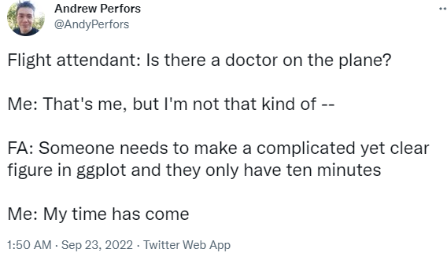

# 431 Class 13: 2023-10-10

[Main Website](https://thomaselove.github.io/431-2023/) | [Calendar](https://thomaselove.github.io/431-2023/calendar.html) | [Syllabus](https://thomaselove.github.io/431-syllabus-2023/) | [Notes](https://thomaselove.github.io/431-notes/) | [Contact Us](https://thomaselove.github.io/431-2023/contact.html) | [Canvas](https://canvas.case.edu) | [Data and Code](https://github.com/THOMASELOVE/431-data)
:-----------: | :--------------: | :----------: | :---------: | :-------------: | :-----------: | :------------:
for everything | for deadlines | expectations | from Dr. Love | get help | lab submission | for downloads

## Today's Slides

Class | Date | Slides | Quarto .qmd | Recording
:---: | :--------: | :------: | :------: | :-------------:
13 | 2023-10-10 | **[Slides 13](https://thomaselove.github.io/431-slides-2023/class13.html)** | [Code 13](https://thomaselove.github.io/431-slides-2023/class13.qmd) | Visit [Canvas](https://canvas.case.edu/), select **Zoom** and **Cloud Recordings**

- To print RevealJS slides **to pdf** from the Slides Link above, [follow these instructions](https://quarto.org/docs/presentations/revealjs/presenting.html#print-to-pdf) using Google Chrome as your browser.

## Announcements

1. There is a [Minute Paper after Class 13](https://bit.ly/431-2023-minute-13), due Wednesday 2023-10-11 at noon.
2. Quiz 1 results and an answer sketch will be available by class time on Thursday 2023-10-12.
3. Project A Proposal Status [updates are here](https://github.com/THOMASELOVE/431-classes-2023/blob/main/projA/projectA_proposal.md).
4. I very slightly updated the Project A report template ([Quarto](https://raw.githubusercontent.com/THOMASELOVE/431-data/main/data-and-code/431-projA-report-template.qmd), [HTML](https://rpubs.com/TELOVE/projectA-report-template)) to incorporate the changes I'd made to the proposal template. Nothing else has changed there.

## Some Important Tips

1. Some Things to Avoid in Titles (although they're OK in subtitles), at least in work you do with me. Clear statements are the goal. *Most of these ideas apply to research questions, and to titles of graphs and other exhibits, too*.
    - Study titles that aren't specific at all, like "Analyzing Data from NHANES" or "Studying County Health Rankings"
    - Throat-clearing phrases like "An Analysis of", "A Study of", "Investigating", "Research" and the like, which can almost always be dropped.
    - Terms I've specifically ruled out: "Project", "431", "Proposal", "Portfolio".
    - Titles that focus on the methods you'll use rather than the questions you'll answer.
    - "Correlation" - most of the time, you're looking at more than just a correlation - "Association" is usually better, or maybe "Relationship".
    - Non-specific determiner words that don't tell us anything specific, like: "Various", "Several", "Some", and so forth.
    - Abbreviations, most especially acronyms and initialisms (other than, in Project A, CHR-2023.)
    - Titles that imply a causal effect when your study cannot possibly find one. "Does Smoking Cause Insufficient Sleep?" in Project A, for example.
    - (Project A-specific) Titles that imply you'll be looking at individuals when your study involves counties within US states, or titles that imply you've done any sort of random sampling or randomization in the work.
    - (specific to Projects A and B for 431) Titles that are more than 80 characters long.
2. When creating a Quarto file, place a blank line **before and after** every code chunk, every header and every paragraph of text. Otherwise, you are asking for trouble.
3. The [CWRU Writing Resource Center](https://case.edu/artsci/writing/resources/writing-resource-center) provides support for writers. If you could use some help, this has been very helpful to numerous past students.
 
## One Last Thing

