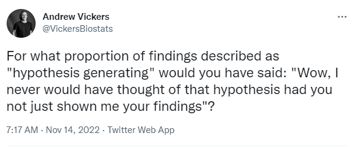

# 431 Class 15: 2023-10-17

[Main Website](https://thomaselove.github.io/431-2023/) | [Calendar](https://thomaselove.github.io/431-2023/calendar.html) | [Syllabus](https://thomaselove.github.io/431-syllabus-2023/) | [Notes](https://thomaselove.github.io/431-notes/) | [Contact Us](https://thomaselove.github.io/431-2023/contact.html) | [Canvas](https://canvas.case.edu) | [Data and Code](https://github.com/THOMASELOVE/431-data)
:-----------: | :--------------: | :----------: | :---------: | :-------------: | :-----------: | :------------:
for everything | for deadlines | expectations | from Dr. Love | get help | lab submission | for downloads

## Today's Slides

Class | Date | Slides | Quarto .qmd | Recording
:---: | :--------: | :------: | :------: | :-------------:
15 | 2023-10-17 | **[Slides 15](https://thomaselove.github.io/431-slides-2023/class15.html)** | [Code 15](https://thomaselove.github.io/431-slides-2023/class15.qmd) | Visit [Canvas](https://canvas.case.edu/), select **Zoom** and **Cloud Recordings**

- To print RevealJS slides **to pdf** from the Slides Link above, [follow these instructions](https://quarto.org/docs/presentations/revealjs/presenting.html#print-to-pdf) using Google Chrome as your browser.

## Announcements

1. There is a [Minute Paper after Class 15](https://bit.ly/431-2023-minute-15), due Wednesday 2023-10-18 at noon. The link is <https://bit.ly/431-2023-minute-15>.
2. Thanks to Fall Break,
    - we don't have class next Tuesday 2023-10-24, and 
    - we won't hold TA hours next Monday 2023-10-23 or Tuesday 2023-10-24, but [Campuswire](https://thomaselove.github.io/431-2023/campuswire.html) will remain open, and
    - Lab 5 is due Thursday 2023-10-26 at Noon instead of the usual Tuesday submission.
3. [Instructions for Lab 5](https://github.com/THOMASELOVE/431-labs-2023/blob/main/lab05/lab05.pdf) are now available.
    - Although this Lab has 10 questions, you are to answer only seven. Everyone will answer questions 1, 5, 9 and 10, but some will then choose to answer 2-4 and others will answer 6-8. Doing all ten questions will yield no benefit to your grade on the Lab, although it might help increase your understanding for Project A analyses 2 and 3.
    - We have already covered all the material we will cover in class that related to Lab 5.
    - Spiegelhalter Chapter 6 is crucial reading before you do Lab 5 Question 10.
    - Instructions for the remaining Labs 6 and 7 (due in November) as well as Lab X [are now available](https://github.com/THOMASELOVE/431-labs-2023/tree/main).
4. [Part C of the Course Notes](https://thomaselove.github.io/431-notes/29-mult_reg_intro.html) (Chapters 29-35) is now posted. This completes the [Fall 2023 Course Notes](https://thomaselove.github.io/431-notes/).
5. An answer sketch for Lab 4 will be posted on Thursday 2023-10-19 by class time.
6. Complete [Project B instructions](https://thomaselove.github.io/431-projectB-2023/) are now available.
    - I strongly suggest ignoring them until you have completed Project A, with the possible exception of using the [Study 1 Sample Report](https://thomaselove.github.io/431-projectB-2023/sample-study1.html) for Project B as a way to review some key issues in confidence interval estimation when comparing means.
    - The first deadline associated with Project B is the [Registration Form](https://bit.ly/431-projB-registration-2023), which is due at 9 AM on Tuesday 2023-11-14.

## This Week

Today's class makes some use of [the pwr package in R](https://github.com/heliosdrm/pwr) to address some issues related to power and sample size calculations associated with assessing differences in population means, or in population proportions.

- Sections 22 and 27 of our Course Notes are particularly relevant.
- Another resource to consider is [A Practical Guide to Statistical Power and Sample Size Calculations in R](https://cran.r-project.org/web/packages/pwrss/vignettes/examples.html) which uses the `pwrss` package instead, and which looks very promising.

On Thursday, we will discuss statistical significance and p values further. Here are three things you might want to glance at before that session:

- "[Not even scientists can easily explain p values](https://fivethirtyeight.com/features/not-even-scientists-can-easily-explain-p-values/)" by Christie Aschwanden at FiveThirtyEight.
- [Statistical Inference in the 21st Century: A World Beyond p < 0.05](https://amstat.tandfonline.com/toc/utas20/73/sup1) from 2019 in *The American Statistician*.
- The American Statistical Association’s 2016 [Statement on p-Values: Context, Process and Purpose](http://amstat.tandfonline.com/doi/full/10.1080/00031305.2016.1154108).

## Project A Proposals

- The Project A materials (Portfolio Report (which includes qmd, Rds and HTML), "Highlight" Video and Self-Evaluation) are due to Canvas at noon on Tuesday 2023-10-31 (two weeks from today.)
- All Project A Proposals have been approved. Status [is available here](https://github.com/THOMASELOVE/431-classes-2023/blob/main/projA/projectA_proposal.md).
- Some trivia and interesting details from [the 45 Project A Proposals are available, too](https://github.com/THOMASELOVE/431-classes-2023/blob/main/projA/projectA_plans.md).
- Don't forget about the [Sample Project A-style Analyses using the Favorite Movies data](https://github.com/THOMASELOVE/431-classes-2023/tree/main/class14#sample-analyses-related-to-project-a) we discussed last Thursday.

## Four Common Issues with the Project A Proposals

- A problem lots of people had (which I mostly didn't mention, but will look for more closely in the portfolios) is that in the codebook (Section 11) you need to specify the years when the data were actually collected by County Health Rankings for your chosen outcome and predictor variables. Look [here for those details](https://www.countyhealthrankings.org/explore-health-rankings/county-health-rankings-measures).
- Try to get through all of Project A without using the word "significant". The reasons why will be clearer after Thursday's class.
- **12** of the 45 proposals had a problem because they used something other than `date: last-modified` in their YAML. Please correct your YAML in your portfolio (we'll be looking for this.)
- **29** of the 45 proposals neglected (at least once) to include a blank line before and after every code chunk, every header (or subheader) and every paragraph. Again, we'd really like you to fix this by the time you submit your portfolio.

## Styling Your Quarto Code

You may be interested in [the styler package](https://github.com/r-lib/styler), which can be used on existing Quarto (or R or R Markdown) code to adapt it to [the tidyverse style guide](https://style.tidyverse.org/).

- This wouldn't resolve misspellings (hit F7 in RStudio to address this, to a degree) or the `date` or blank line issues mentioned above, but is still useful.

## Breakout Session 2 for Favorite Movies is coming soon...

See [this link](https://github.com/THOMASELOVE/431-classes-2023/blob/main/movies/breakout2.md) for details. We'll get to this today if we have time.

## One Last Thing

[Teaching the Difficult Past of Statistics to Improve the Future](https://www.tandfonline.com/doi/full/10.1080/26939169.2023.2224407) by Lee Kennedy-Shaffer is an interesting paper. Here's the abstract:

> In recent years, the discipline of statistics has begun reckoning with its difficult history. Institutions are reconsidering names that have honored key historical figures in statistics who have deep ties to eugenics movements and racial and class prejudice. These names, however, continue to appear in our classrooms, where we teach the methods created by these individuals, raising the question of how instructors should address their legacies. Three examples of famous statisticians and their work—Francis Galton’s use of conditional probabilities to demonstrate “hereditary talent,” Karl Pearson’s attempt to quantify the intelligence of Jewish immigrant students, and Ronald A. Fisher’s creation of the analysis of variance to de-emphasize environment in human development—highlight the intimate ties between statistics and eugenics. These examples, along with a discussion of the context of these men, eugenics movements, and the statisticians and scientists who opposed their eugenic programs, can humanize the field for students, teach them about the challenges in accurate and unbiased data collection and analysis, and connect historical mistakes to contemporary ethical issues. Confronting this history in the classroom can both improve the teaching of the statistical methodologies themselves and begin a broader conversation about the role of statistics in the world.
