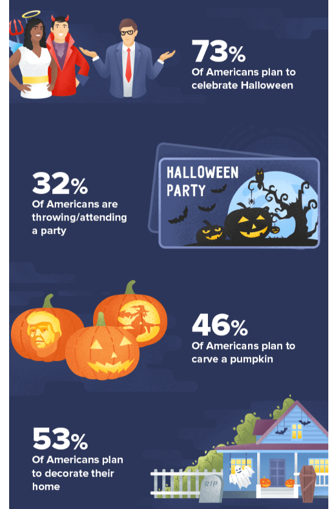

# 431 Class 18: 2023-10-31

[Main Website](https://thomaselove.github.io/431-2023/) | [Calendar](https://thomaselove.github.io/431-2023/calendar.html) | [Syllabus](https://thomaselove.github.io/431-syllabus-2023/) | [Notes](https://thomaselove.github.io/431-notes/) | [Contact Us](https://thomaselove.github.io/431-2023/contact.html) | [Canvas](https://canvas.case.edu) | [Data and Code](https://github.com/THOMASELOVE/431-data)
:-----------: | :--------------: | :----------: | :---------: | :-------------: | :-----------: | :------------:
for everything | for deadlines | expectations | from Dr. Love | get help | lab submission | for downloads

## Today's Slides

Class | Date | Slides | Quarto .qmd | Recording
:---: | :--------: | :------: | :------: | :-------------:
18 | 2023-10-31 | **[Slides 18](https://thomaselove.github.io/431-slides-2023/class18.html)** | [Code 18](https://thomaselove.github.io/431-slides-2023/class18.qmd) | Visit [Canvas](https://canvas.case.edu/), select **Zoom** and **Cloud Recordings**

- To print RevealJS slides **to pdf** from the Slides Link above, [follow these instructions](https://quarto.org/docs/presentations/revealjs/presenting.html#print-to-pdf) using Google Chrome as your browser.

- This is an excerpt from [Halloween Facts Infographic: Spooky Stats for 2023](https://wallethub.com/blog/halloween-facts/25374) by John S. Kiernan

## Announcements

1. There is a [Minute Paper after Class 18](https://bit.ly/431-2023-minute-18), due at noon Wednesday 2023-11-01. The link is <https://bit.ly/431-2023-minute-18>.
2. Grades and feedback on Lab 5 are now posted to the 431 Grades Roster on our Shared Drive.
    - I posted a slight revision to the Answer Sketch for Lab 5 on Sunday 2023-10-29, to fix a typo in the answer to Question 9. You'll find it in our Shared Drive.
3. Project A initial checks will be completed on Wednesday 2023-11-01 by 9 AM. You will get an **email from Dr. Love** if we spot an important issue.
    - If you're getting a warning like: *WARNING: Warning: diff of engine output timed out. No source lines will be available.* you may have a problem where your HTML on Canvas doesn't look like your HTML on your machine - something has gone wrong in the rendering. Potential solutions:
        1. Close R Studio, re-open R Studio and [update your packages](https://thomaselove.github.io/431-2023/software.html#updating-your-r-packages) then close R Studio again, and re-open it, then try rendering your .qmd document again.
        2. Shut down your computer instead of just closing R Studio, and then restart it, and open RStudio, select the qmd file, and re-render.
        3. The `gt` package appears to create some of these problems, especially when you adjust fonts. They're working on it at Posit, but for the moment it's an issue. I just learned this last night. Not sure what to do about it, though.
    - Updates on our review [are posted here](https://github.com/THOMASELOVE/431-classes-2023/blob/main/projA/portfolio_status.md) irregularly.
    - Ignore the "Assessment" score on Canvas, which is 1 if we've finished Form 1, or if you've submitted the one-pager for your team. 
    - We hope to get you detailed feedback **which will come via email, not Canvas** by class time on 2023-11-09.
4. Remember that we don't have 431 class on Tuesday 2023-11-07 (Election Day) although this is not a CWRU holiday.
    - TA office hours will be held as usual on Election Day.
5. [Lab 6](https://github.com/THOMASELOVE/431-labs-2023/tree/main) is due at Noon on Thursday 2023-11-09.
    - You should be able to complete Lab 6 after Class 19 (Thursday 2023-11-02.) I corrected a minor typo on Monday 2023-10-30.
6. I've added the `corrr` package to [our list of packages you should install](https://github.com/THOMASELOVE/431-packages), although we won't use it today.
7. The [Project B](https://thomaselove.github.io/431-projectB-2023/) registration form (due at 9 AM 2023-11-14) will open before Class 19 on Thursday 2023-11-02.
 
## One Last Thing

[The Ultimate Halloween Candy Power Ranking](https://fivethirtyeight.com/videos/the-ultimate-halloween-candy-power-ranking/) from FiveThirty Eight in 2017.

- Data available [on Github](https://github.com/fivethirtyeight/data/tree/master/candy-power-ranking)
- Check out the survey at [What's the best Halloween candy?](https://walthickey.com/2017/10/18/whats-the-best-halloween-candy/)
