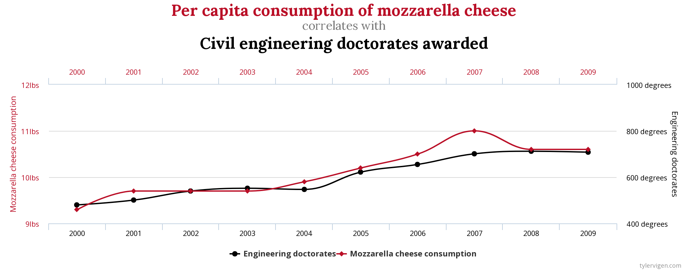

# 431 Class 19: 2023-11-02

[Main Website](https://thomaselove.github.io/431-2023/) | [Calendar](https://thomaselove.github.io/431-2023/calendar.html) | [Syllabus](https://thomaselove.github.io/431-syllabus-2023/) | [Notes](https://thomaselove.github.io/431-notes/) | [Contact Us](https://thomaselove.github.io/431-2023/contact.html) | [Canvas](https://canvas.case.edu) | [Data and Code](https://github.com/THOMASELOVE/431-data)
:-----------: | :--------------: | :----------: | :---------: | :-------------: | :-----------: | :------------:
for everything | for deadlines | expectations | from Dr. Love | get help | lab submission | for downloads

## Today's Slides

Class | Date | Slides | Quarto .qmd | Recording
:---: | :--------: | :------: | :------: | :-------------:
19 | 2023-11-02 | **[Slides 19](https://thomaselove.github.io/431-slides-2023/class19.html)** | [Code 19](https://thomaselove.github.io/431-slides-2023/class19.qmd) | Visit [Canvas](https://canvas.case.edu/), select **Zoom** and **Cloud Recordings**

- To print RevealJS slides **to pdf** from the Slides Link above, [follow these instructions](https://quarto.org/docs/presentations/revealjs/presenting.html#print-to-pdf) using Google Chrome as your browser.

## Announcements

1. Feedback from the Minute Paper after Class 18 [is now available](https://bit.ly/431-2023-min-18-feedback). Thanks to those of you who completed it.
2. Remember that we don't have 431 class on Tuesday 2023-11-07 (Election Day) although this is not a CWRU holiday.
    - TA office hours will be held as usual on Election Day.
3. Project A feedback: our goal remains 2023-11-09 by 1 PM. Updates on [our progress here](https://github.com/THOMASELOVE/431-classes-2023/blob/main/projA/portfolio_status.md).
4. [Lab 6](https://github.com/THOMASELOVE/431-labs-2023/tree/main) is due at Noon on Thursday 2023-11-09.
    - You should be able to complete Lab 6 after today's class.
5. I encourage you strongly to read the [Project B instructions](https://thomaselove.github.io/431-projectB-2023/) between now and our next class (Thursday 2023-11-09).
    - The [Project B registration form](https://bit.ly/431-projB-registration-2023) is now open, and is due on Tuesday 2023-11-14 at 9 AM.
    - [What do you need to do before filling out the Project B Registration Form?](https://thomaselove.github.io/431-projectB-2023/register.html#what-do-you-need-to-do-before-filling-out-the-form) Five things, as indicated in the link.
6. [Lab X](https://thomaselove.github.io/431-labX/) is due on 2023-12-12.
    - Lab X submissions received so far are [posted here](https://github.com/THOMASELOVE/431-classes-2023/tree/main/labX).
7. [Here are some results](https://github.com/THOMASELOVE/431-classes-2023/blob/main/class19/beyond005.md) from the Bonus Opportunity on Campuswire that expired this morning.

## Supplemental Material for Today's Class

1. The `dm1.Rds` data are provided in the `data` subfolder for this class, as well as on our [431-data page](https://github.com/THOMASELOVE/431-data).
2. Wikipedia article on [Hirotogu Akaike](https://en.wikipedia.org/wiki/Hirotugu_Akaike) and the [Akaike Information Criterion](https://en.wikipedia.org/wiki/Akaike_information_criterion) along with [How to Pronounce "Akaike"](https://www.youtube.com/watch?v=RjR1LK_SGYs)
3. Wikipedia article on [Thomas Bayes](https://en.wikipedia.org/wiki/Thomas_Bayes) and the [Bayesian Information Criterion](https://en.wikipedia.org/wiki/Bayesian_information_criterion).
4. [Posit Cheat Sheets](https://rstudio.github.io/cheatsheets/) are great. Today we'll look a bit at the one on **Data Transformation with dplyr**. [HTML is here](https://rstudio.github.io/cheatsheets/html/data-transformation.html), while [pdf is here](https://rstudio.github.io/cheatsheets/data-transformation.pdf).

## One Last Thing

 

- Note the correlation is 0.9586 for the two measures plotted above.
- Some more fun examples of the [difference between correlation and causation](http://www.tylervigen.com/spurious-correlations), from Tyler Vigen.
