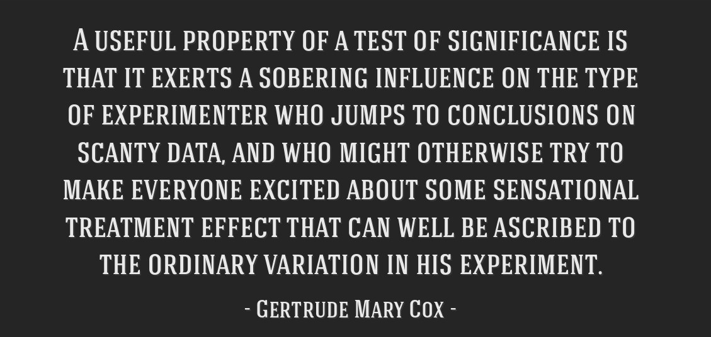

# 431 Class 22: 2023-11-16

[Main Website](https://thomaselove.github.io/431-2023/) | [Calendar](https://thomaselove.github.io/431-2023/calendar.html) | [Syllabus](https://thomaselove.github.io/431-syllabus-2023/) | [Notes](https://thomaselove.github.io/431-notes/) | [Contact Us](https://thomaselove.github.io/431-2023/contact.html) | [Canvas](https://canvas.case.edu) | [Data and Code](https://github.com/THOMASELOVE/431-data)
:-----------: | :--------------: | :----------: | :---------: | :-------------: | :-----------: | :------------:
for everything | for deadlines | expectations | from Dr. Love | get help | lab submission | for downloads

## Today's Slides

Class | Date | Slides | Quarto .qmd | Recording
:---: | :--------: | :------: | :------: | :-------------:
22 | 2023-11-16 | **[Slides 22](https://thomaselove.github.io/431-slides-2023/class22.html)** | [Code 22](https://thomaselove.github.io/431-slides-2023/class22.qmd) | Visit [Canvas](https://canvas.case.edu/), select **Zoom** and **Cloud Recordings**

- To print RevealJS slides **to pdf** from the Slides Link above, [follow these instructions](https://quarto.org/docs/presentations/revealjs/presenting.html#print-to-pdf) using Google Chrome as your browser.

## Announcements

1. 431 is canceled next Tuesday and all of CWRU is closed next Thursday. Our next class (Class 23) will be Tuesday 2023-11-28.
    - Dr. Love will be out of town and won't see email or Campuswire (essentially) between Sunday 2023-11-19 and Saturday 2023-11-25.
    - TA office hours are canceled starting SUN 2023-11-19 through SAT 2023-11-25, restarting SUN 2023-11-26.
2. Grades and feedback on Lab 6 are now available on our Course Grading Roster.
    - We have also posted a few of the responses to Lab 6 Question 5 that we liked on our Shared Drive.
3. Grades and feedback on Project A should be in your hands **today**.
    - You should receive (via your **CWRU email**) a link from me to a Google Doc of feedback that only you and I can see.
    - It may be helpful to be aware of how we did the reviews - [see here](https://github.com/THOMASELOVE/431-classes-2023/blob/main/projA/portfolio_status.md#stages-of-review-tas-work-on-forms-2-6-dr-love-does-the-rest) for those details. I wrote about 95% of the comments you'll find, and edited the rest.
    - These documents are about five pages long, and represent hours of work by the TAs and myself. **Please** read it when you get it.
4. Feedback on your [Project B registration form](https://bit.ly/431-projB-registration-2023) will be sent to you as soon as I can get to it.
    - If you are one of the three people (Manu Bulusu, Lydia Mitchell and Anthony Nunnery) who haven't yet submitted the form (and everyone needs to do this, even if you have a partner and the partner has done it already), please get it in now.
5. [Lab 7](https://github.com/THOMASELOVE/431-labs-2023/tree/main) is due on the Tuesday after Thanksgiving, 2023-11-28 at Noon.
6. If you haven't yet, you'll want to catch up on reading *The Art of Statistics*, at least through Chapter 12, over the Thanksgiving break.

## References from Today's Slides

- [Common statistical tests are linear models](https://lindeloev.github.io/tests-as-linear/) by Jonas Kristoffer Lindeløv.
- Sterne JAC et al [Multiple imputation for missing data in epidemiological and clinical research: potential and pitfalls](https://www.bmj.com/content/338/bmj.b2393) BMJ 2009; 338:b2393.
- The mice (Multivariate Imputation by Chained Equations) package [reference page](https://amices.org/mice/).
    - Stef van Buuren, Karin Groothuis-Oudshoorn (2011). [mice: Multivariate Imputation by Chained Equations in R](https://www.jstatsoft.org/article/view/v045i03). Journal of Statistical Software, 45(3), 1-67. DOI 10.18637/jss.v045.i03.
- Framingham Heart Study at https://www.framinghamheartstudy.org/
- Heymans MW and Eekhout I [Applied Missing Data Analysis with SPSS and RStudio](https://bookdown.org/mwheymans/bookmi/)
- The `mipo` (Multiple Imputation pooled object) help file [can be found here](https://rdrr.io/cran/mice/man/mipo.html).

## Taking Other Courses With Me

In addition to 431, I teach two other semester-long courses, called **PQHS 432** and **PQHS 500**. I will teach both 432 and 500 in Spring 2024. Here's my advice, for what it's worth ...

- **432** is the continuation of this course (widely regarded as the "better" half.) I think **everyone** in this class should be planning to take 432 this Spring (i.e. Spring 2024), **unless** you don't feel you've received sufficient value from this course and don't need to take 432 to finish your program at CWRU, **or** you have an unshakable conflict in Spring 2024 (especially if you plan to instead take 432 in Spring 2025.)
    - I will provide the 432 website and syllabus to everyone enrolled in 432 in mid-January. The Spring 2023 syllabus for 432 is [here](https://thomaselove.github.io/432-syllabus-2023/) but of course, things will change, in ways I will start to think about after Christmas. The 432 class begins on 2024-01-16, and is held on Tuesdays and Thursdays from 1:00 to 2:15 PM.
- **500** is a project-based and more advanced course covering specific topics in the design and analysis of observational studies. 
    - I think everyone in this class who is interested in taking 500 should do so at some point. The course is mostly about using propensity scores well to help design (and analyze) data from observational studies where we want to estimate a causal effect.
    - A revised syllabus for the Spring 2024 version of the course will be available in mid-January. The Spring 2023 syllabus for 500 is [here](https://thomaselove.github.io/500-syllabus-2023/), but of course, things will change in ways I will start to think about after Christmas. The 500 course begins on 2024-01-18, and is held on Thursdays from 8:30 to 11 AM.
    - I especially think MS and PhD students (in any department) interested in applications of health research in real world situations should take it, as well as people looking for jobs in fields related to health care analytics.
    - For some people, it's better to complete 432 before taking 500 for several reasons, most especially ...
        1. percolation time for some of the ideas in 431/432
        2. too much of me at one time can be overwhelming
    - If Spring 2024 is your best opportunity to take 500, then I will certainly permit you to do so. Send me an email anytime if you want to discuss this.

## One Last Thing

Enjoy the break!
