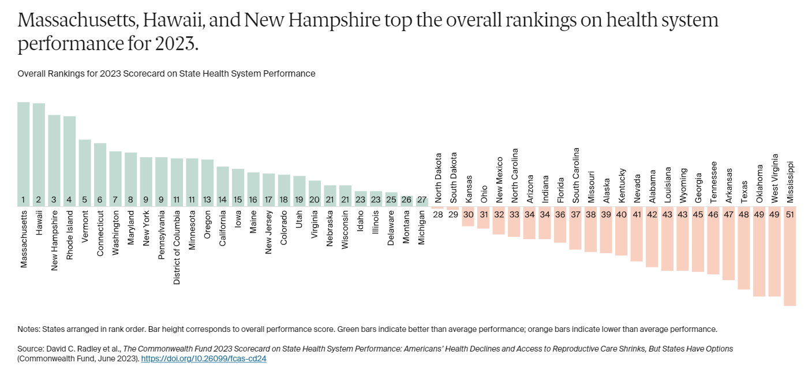

# 431 Class 24: 2023-11-30

[Main Website](https://thomaselove.github.io/431-2023/) | [Calendar](https://thomaselove.github.io/431-2023/calendar.html) | [Syllabus](https://thomaselove.github.io/431-syllabus-2023/) | [Notes](https://thomaselove.github.io/431-notes/) | [Contact Us](https://thomaselove.github.io/431-2023/contact.html) | [Canvas](https://canvas.case.edu) | [Data and Code](https://github.com/THOMASELOVE/431-data)
:-----------: | :--------------: | :----------: | :---------: | :-------------: | :-----------: | :------------:
for everything | for deadlines | expectations | from Dr. Love | get help | lab submission | for downloads

## From [The Commonwealth Fund's 2023 Scorecard on State Health System Performance](https://www.commonwealthfund.org/publications/scorecard/2023/jun/2023-scorecard-state-health-system-performance)

## Today's Slides

Class | Date | Slides | Quarto .qmd | Recording
:---: | :--------: | :------: | :------: | :-------------:
24 | 2023-11-30 | **[Slides 24](https://thomaselove.github.io/431-slides-2023/class24.html)** | [Code 24](https://thomaselove.github.io/431-slides-2023/class24.qmd) | Visit [Canvas](https://canvas.case.edu/), select **Zoom** and **Cloud Recordings**

- To print RevealJS slides **to pdf** from the Slides Link above, [follow these instructions](https://quarto.org/docs/presentations/revealjs/presenting.html#print-to-pdf) using Google Chrome as your browser.

## Announcements

1. The Project B Schedule of Presentations [is available here](https://github.com/THOMASELOVE/431-classes-2023/blob/main/projB/schedule.md). Plan to join the Zoom call (or arrive at my office) five minutes before your presentation begins.
2. I added three packages ([xfun](https://github.com/yihui/xfun), [epibasix](https://cran.r-project.org/web/packages/epibasix/index.html) and [exact2x2](https://cran.r-project.org/web/packages/exact2x2/index.html)) to the [list of recommended R packages to install](https://github.com/THOMASELOVE/431-packages/tree/main). I'll use functions from each of the three in today's class.
3. Someone asked me a while back about saving a table built in the gt package as a file - what you want is [the `gtsave()` function](https://gt.rstudio.com/reference/gtsave.html), I think.
    - Lots of additional ways to export and extract these tables (as Word files, or LaTeX, or in other ways) are found on [the gt package reference page](https://gt.rstudio.com/reference/index.html).
4. Quiz 2 materials will be completely posted **by 5 PM today**. Visit <https://github.com/THOMASELOVE/431-quizzes-2023/tree/main/quiz2>.
    - Quiz 2 is now due **Tuesday 2023-12-05 at 3 PM**. The Google Form will close to submissions at 3:30 PM.
    - The Quiz involves two essays (questions 1 and 24), one of which is about Spiegelhalter's book.
    - The other 22 questions are skewed heavily towards material discussed in the slides for Classes 12-23.
5. Class 25 on Tuesday 2023-12-05 will be given **via Zoom** rather than in person, and it will include some work with [the favorite movies](https://github.com/THOMASELOVE/431-classes-2023/tree/main/movies), as well as an "Ask Me Anything" session.
6. Feedback on the Minute Paper after Class 23 [is now available](https://bit.ly/431-2023-min-23-feedback).
7. An Answer Sketch for Lab 7 will be posted **by class time**.
8. With regard to [Lab X](https://thomaselove.github.io/431-labX/), I will post a video of myself creating and posting a basic website before our class on Tuesday 2023-12-05.
    - [Lab X](https://thomaselove.github.io/431-labX/) is due (for those who choose to do it) on 2023-12-12 at noon.

## References from Today's Slides

- The [here package](https://here.r-lib.org/)
    - Jenny Bryan's [Ode to the here package](https://github.com/jennybc/here_here)
    - Jenny Bryan on [Project-oriented workflow](https://www.tidyverse.org/blog/2017/12/workflow-vs-script/)
- More on [the `replace_with_na()` function](https://cran.r-project.org/web/packages/naniar/vignettes/replace-with-na.html) from naniar, and [the `replace_na()` function](https://tidyr.tidyverse.org/reference/replace_na.html) from tidyr.
- [Here is the study](https://www.nejm.org/doi/full/10.1056/nejmoa030204) that motivated Example 2 on Power Calculations today. The citation is Batterham RL et al. Inhibition of Food Intake in Obese Subjects by Peptide $YY_{3-36}$, N Engl J Med 2003-09-04: 349: 941-948. [DOI: 10.1056/NEJMoa030204](https://www.nejm.org/doi/full/10.1056/NEJMoa030204)
- ASA Statement on [The Role of Statistics in Data Science and Artificial Intelligence](https://www.amstat.org/docs/default-source/amstat-documents/the-role-of-statistics-in-data-science-and-artificial-intelligence.pdf), (pdf) 2023-08-04.
- [ChatGPT](https://chat.openai.com/)

## Interested in getting PDF data into R?

- [Extracting Data from PDFs into Tibbles](https://michaeltopper.netlify.app/post/extracting-data-from-pdf-to-table/) by Michael Topper
- [Reading in data from PDF](https://bookdown.org/Maxine/r4ds/pdf.html) which discusses [the pdftools package](https://github.com/ropensci/pdftools).
- [Reading PDF Files into R for Text Mining](https://library.virginia.edu/data/articles/reading-pdf-files-into-r-for-text-mining) from the University of Virginia Library.
- [The Adventure of PDF to Data Frame in R](https://medium.com/swlh/the-adventure-of-pdf-to-data-frame-in-r-f90609035600) by Justin Cocco
- [read_pdf(): read a portable document format into R](https://rdrr.io/cran/textreadr/man/read_pdf.html) and [the textreadr package](https://github.com/trinker/textreadr) oif tools for reading text documents into R.

## One Last Thing

**Power Analysis by Data Simulation in R** is a nice set of blog posts by Julian Quandt, complete with R code, written in 2020-2022.

1. [Part I](https://julianquandt.com/post/power-analysis-by-data-simulation-in-r-part-i/) *This part provides an introduction, some background on power-calculation and data-simulation.*
2. [Part II](https://julianquandt.com/post/power-analysis-by-data-simulation-in-r-part-ii/) *This part foucuses on simple scenarios (t-tests) to introduce the simulation of correlated measurements and multivariate normal-distributions*
3. [Part III](https://julianquandt.com/post/power-analysis-by-data-simulation-in-r-part-iii/) *This part extends the previous part by generalizing data simulation to ANOVA and general linear model designs.*
4. [Part IV](https://julianquandt.com/post/power-analysis-by-data-simulation-in-r-part-iv/) *This final part extends the previous part by generalizing data simulation linear mixed-effects models.*
